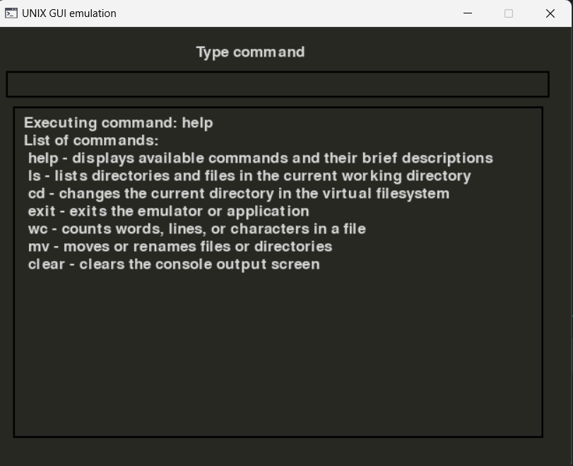
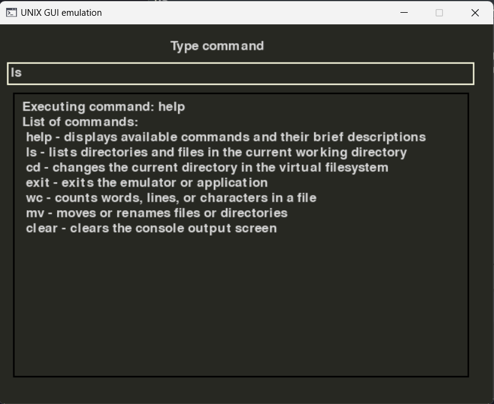
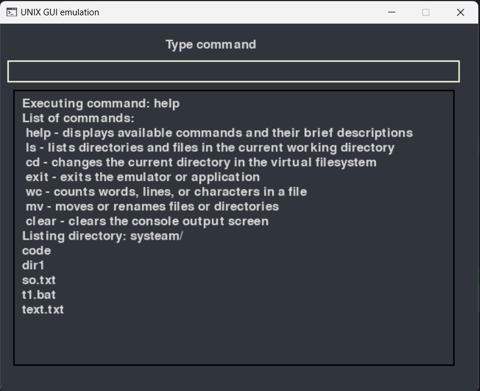

# GUI_UNIX_OS

---

An emulator for the operating system language was created. The emulator's operation is similar to a shell session in a UNIX-like OS. The emulator accepts a virtual file system image in the form of a zip file.


# 🖼️ Gallery

---








# 📘 Installation and running

---

```commandline
git clone https://github.com/Nikindrik/GUI_UNIX_OS
cd GUI_UNIX_OS
python -m venv venv
```
For windows
```commandline
.\venv\Scripts\activate   
```
For linux/UNIX/MAC
```commandline
source venv/bin/activate
```
Run
```commandline
python main.py --user <user_name> --archive <archive_name.zip> --script <start_script_name.sh>
```
Example
```editorconfig
python main.py --user nick --archive systeam.zip --script start.sh
```

# 💻 Command in UNIX emulation

---

* **Displays available commands and their brief descriptions** - `help`
* **Lists directories and files in the current working directory** - `ls`
* **Changes the current directory in the virtual filesystem** - `cd`
* **Exits the emulator or application** - `exit`
* **Counts words, lines, or characters in a file** - `wc`
* **Moves or renames files or directories** - `mv`
* **Clears the console output screen** - `clear`

---

The project is actively developing, so you can offer your ideas for improvements and visit [my git](https://github.com/Nikindrik).